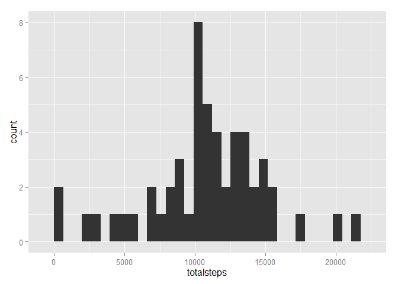
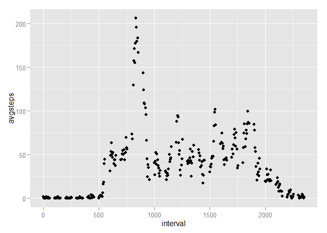
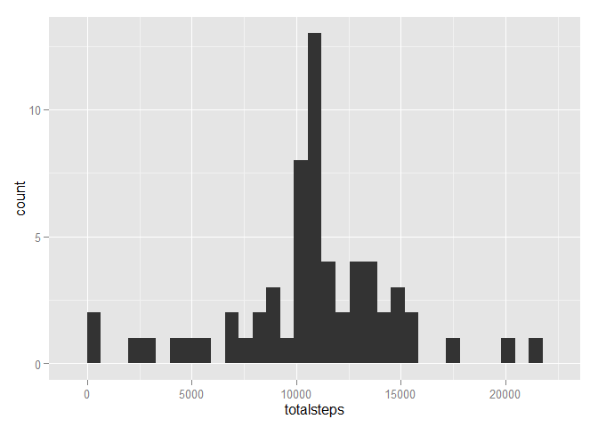
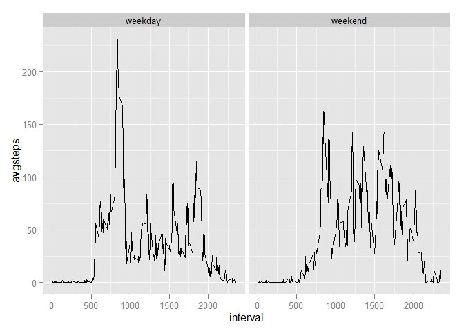

# Reproducible Research: Peer Assessment 1


## Loading and preprocessing the data

We start by uncompressing the source data, then reading it in to a data.table:


```r
library(data.table)

# check if we already have the uncompressed data - if not unzip the archive.
if (! file.exists("activity.csv")) {
        unzip("activity.zip")
}

# read in the data
activity <- fread("activity.csv")

# check if data has been read ok.
activity
```

```
##        steps       date interval
##     1:    NA 2012-10-01        0
##     2:    NA 2012-10-01        5
##     3:    NA 2012-10-01       10
##     4:    NA 2012-10-01       15
##     5:    NA 2012-10-01       20
##    ---                          
## 17564:    NA 2012-11-30     2335
## 17565:    NA 2012-11-30     2340
## 17566:    NA 2012-11-30     2345
## 17567:    NA 2012-11-30     2350
## 17568:    NA 2012-11-30     2355
```

```r
summary(activity)
```

```
##      steps            date              interval     
##  Min.   :  0.00   Length:17568       Min.   :   0.0  
##  1st Qu.:  0.00   Class :character   1st Qu.: 588.8  
##  Median :  0.00   Mode  :character   Median :1177.5  
##  Mean   : 37.38                      Mean   :1177.5  
##  3rd Qu.: 12.00                      3rd Qu.:1766.2  
##  Max.   :806.00                      Max.   :2355.0  
##  NA's   :2304
```

We do not do any further pre-processing at this stage.

## What is mean total number of steps taken per day?

To answer this question let's start by plotting the total number of steps taken
each day:


```r
library(ggplot2)
library(dplyr)

# total up the number of steps taken per day
steps_by_day <- group_by(activity, date) %>% summarise(totalsteps = sum(steps))

# plot a histogram
qplot(x = totalsteps, data = steps_by_day, geom = "histogram", binwidth = 660)
```



Now let's calculate the mean and median:

```r
mean(steps_by_day$totalsteps, na.rm = TRUE)
```

```
## [1] 10766.19
```

```r
median(steps_by_day$totalsteps, na.rm = TRUE)
```

```
## [1] 10765
```


## What is the average daily activity pattern?

Here's a time-series plot of of the 5-minute interval (x-axis) and the average 
number of steps taken, averaged across all days (y-axis):


```r
steps_by_interval <- 
        group_by(activity, interval) %>% 
        summarize(avgsteps = mean(steps, na.rm = TRUE))

qplot(x = interval, y = avgsteps, data = steps_by_interval)
```



From the plotted dataset we can calculate which interval has the most number of
steps:

```r
filter(steps_by_interval, avgsteps == max(steps_by_interval$avgsteps))
```

```
## Source: local data table [1 x 2]
## 
##   interval avgsteps
##      (int)    (dbl)
## 1      835 206.1698
```

So the answer is the 08:35 interval.


## Imputing missing values

First we find the number of `NA`s in the data:

```r
sum(is.na(activity))
```

```
## [1] 2304
```

To fill all of these NAs, we will use the average value of the 5-minute interval
that was calculated on the previous question. We round the average, since all 
of the original values were integers:

```r
s2 <- vector(length = length(activity$steps))

for (i in 1:length(s2)) {
        if (is.na(activity$steps[i])) {
                s2[i] <- round(filter(steps_by_interval, 
                                      interval == activity$interval[i])$avgsteps)
        } else {
                s2[i] <- activity$steps[i]
        }
}

all_activity <- data.table(steps = s2, date = activity$date, 
                           interval = activity$interval)
```

Now we make a new histogram with this dataset, and calculate the median and
mean:

```r
# total up the number of steps taken per day with new dataset
steps_by_day_2 <- group_by(all_activity, date) %>% 
        summarise(totalsteps = sum(steps))

# plot a histogram
qplot(x = totalsteps, data = steps_by_day_2, geom = "histogram", binwidth = 660)
```



```r
# calculate the mean and median:
mean(steps_by_day_2$totalsteps)
```

```
## [1] 10765.64
```

```r
median(steps_by_day_2$totalsteps)
```

```
## [1] 10762
```

We can see that the mean and median changed slightly, since we introduced some
new values. If we had used the exact numbers (i.e., fractional) from the 
calculated interval average, then the shift would be very small - but the data
would be "off" (because people don't usually take fractional numbers of steps).

## Are there differences in activity patterns between weekdays and weekends?

Let's start by creating a new factor variable that indicates if a given day is
a weekday or not:

```r
# save current locale
cloc <- Sys.getlocale("LC_TIME")

# set locale to english for dependable day names (windows systems)
Sys.setlocale("LC_TIME", "English_US")
```

```
## [1] "English_United States.1252"
```

```r
# define a small function to figure out if a date is a weekend:
is.we <- function(d) {
        sapply(d, function(dat) {
                r <- 1
                wd <- weekdays(as.Date(dat))
                
                if (grepl("Saturday", wd, ignore.case = TRUE) || 
                    grepl("Sunday", wd, ignore.case = TRUE)) {
                        r <- 2
                }
                
                r        
        }
        )
        
}

# create a new variable over the data
all_activity <- mutate(all_activity, day = is.we(date))

# make a new by-interval summary 
steps_by_interval_2 <- 
        group_by(all_activity, interval, day) %>% 
        summarize(avgsteps = mean(steps))


# change variable into factor
steps_by_interval_2 <- mutate(steps_by_interval_2,
                              nday = factor(day, levels = c(1,2),
                                           labels = c("weekday", "weekend")))

# reset locale to original
Sys.setlocale("LC_TIME", cloc)
```

```
## [1] "Portuguese_Portugal.1252"
```

```r
# plot average steps per day, for weekdays and weekends
qplot(x = interval, y = avgsteps, facets = . ~ nday, 
      data = steps_by_interval_2, geom = "line")
```



We can see from the plots that the activity patterns are different for weekends
and weekdays.
